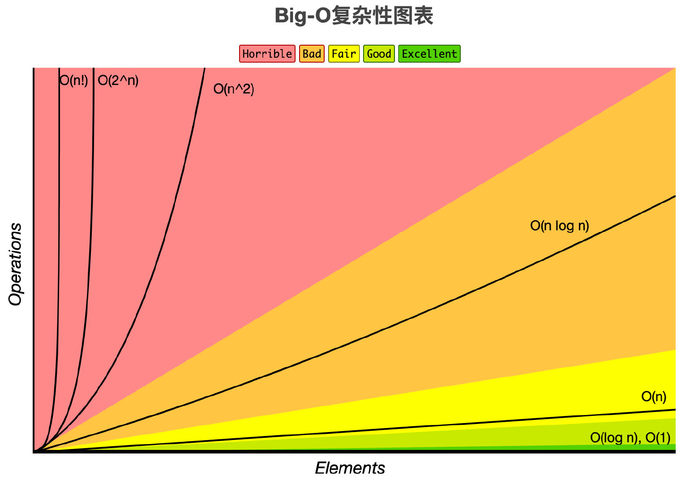

# data structure && algorithm

##phone interview && website
    1.colladebit.com
    2.coderpad.io 


## working abroad
    1.studying abroad
    2.working at global china
    3.submit a resume to foreign enterprise (H1-B visa)


## complexity of an algorithm
    1.time complexity
    2.space complexity
    
##big o notation
    1.o(1)
    2.o(log(n))
    3.o(n)
    4.o(n^2)
    5.o(n^3)
    6.o(n^4)
    7.o(2^n)
    8.o(n!)


````
o(1)
    int i = 100;
    System.out.print(i) 

o(n)
    for(int i=0; i<n; i++){
        dosomething();
    }
    
o(n^2)
    for(int i=0; i<n; i++){
        for(int j=0; j<n; j++){
                dosomething();
        }
    }


o(log(n))
    for(int i=0; i<n; i = i*2){
        dosomething();
    }
    
o(k^n)
    for(int i=0; i<Math(2,n); i++){
        dosomething();
    }
   
````
 
 
 
 
 
 
 
 ##Fabonacii array 1,1,2,3,5,8,13,21,34
 F(N) = F(N-1) + F(N-2)
 o(2^n)
 
 Binary search o(log(n))
 
 Binary tree traversal o(n)
 
 Merge sort o(nlog(n))
 
 
 https://leetcode.com/problemset/all/
 https://leetcode-cn.com/interview/
 
 
 
 
 
 
 
 
 
 
 
 